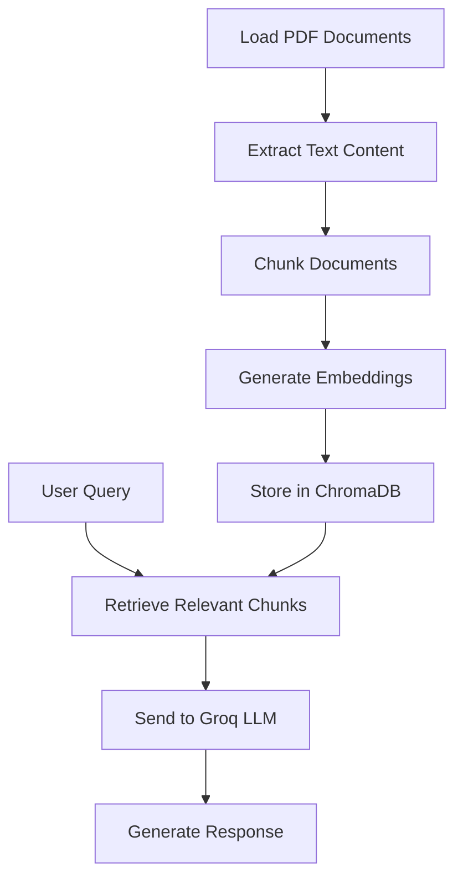

# RAG System for Thyroid Disorder Documents

A Retrieval-Augmented Generation (RAG) system that processes thyroid disorder PDF documents, stores them in a vector database, and provides AI-powered answers using Groq's language model.

## Features

- **Document Loading**: Automatically loads and processes PDF documents from a specified folder
- **Text Chunking**: Splits documents into manageable chunks for better retrieval
- **Vector Embeddings**: Uses ChromaDB for efficient vector storage and similarity search
- **AI-Powered Responses**: Leverages Groq's fast inference for generating accurate answers
- **Environment Configuration**: Secure API key management using environment variables

## Architecture



## Installation

1. **Clone the repository**:
   ```bash
   git clone https://github.com/Poojapbabar-ai/RAG.git
   cd RAG
   ```

2. **Create a virtual environment**:
   ```bash
   python -m venv azure_l
   source azure_l/Scripts/activate  # On Windows: azure_l\Scripts\activate
   ```

3. **Install dependencies**:
   ```bash
   pip install -r requirements.txt
   ```

4. **Set up environment variables**:
   Create a `.env` file in the root directory:
   ```
   GROQ_API_KEY=your_groq_api_key_here
   ```

## Usage

1. **Prepare your documents**:
   Place your PDF files in the `Thyroid/` folder.

2. **Run the RAG system**:
   ```bash
   python rag.py
   ```

   The script will:
   - Load all PDF documents from the Thyroid folder
   - Process and chunk the content
   - Store embeddings in ChromaDB
   - Display the number of loaded documents

3. **Query the system**:
   Modify `rag.py` to include your query logic for retrieving and generating answers.

## Project Structure

```
.
├── rag.py                 # Main RAG implementation
├── requirements.txt       # Python dependencies
├── Readme.md             # This file
├── .env                  # Environment variables (not committed)
├── .gitignore            # Git ignore rules
├── Thyroid/              # Folder containing PDF documents
│   ├── document1.pdf
│   ├── document2.pdf
│   └── ...
└── azure_l/              # Virtual environment (not committed)
```

## Requirements

- Python 3.8+
- Groq API key
- PDF documents in the Thyroid folder

## Dependencies

- groq: For AI language model interactions
- langchain-community: For document loading and processing
- chromadb: Vector database for embeddings
- python-dotenv: Environment variable management
- scipy: Scientific computing (dependency of chromadb)

## Security

- API keys are stored in environment variables, not hardcoded
- Sensitive files are excluded from version control via `.gitignore`

## Contributing

1. Fork the repository
2. Create a feature branch
3. Make your changes
4. Submit a pull request

## License

This project is licensed under the MIT License - see the LICENSE file for details.